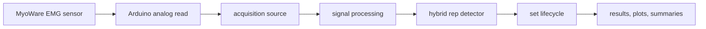
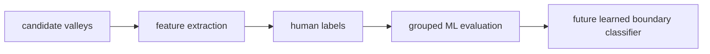

# RepAI

EMG-powered workout analysis that detects reps, automatically recognizes set completion, and analyzes muscle-activation patterns.

RepAI is a v0.1 research prototype. It is a student engineering project, not a medical device, clinical tool, or validated strength assessment system. Public examples in this repository are synthetic so reviewers can run the workflow without private recordings.

## Demo / What RepAI Does

RepAI reads MyoWare-style EMG samples from Arduino serial hardware or a replay CSV, smooths the signal, detects contraction cycles, and writes set summaries, plots, and local reports. The Streamlit app supports signal checks, recording/replay, real-time set lifecycle state, protocol capture, Dataset Builder review, detector comparison, and activation comparison workflows.

To try it without hardware, use the included deterministic synthetic fixture:

```bash
python -m streamlit run app/streamlit_app.py
```

In the app, choose replay mode and load:

```text
examples/synthetic/synthetic_bicep_curl_6_reps.csv
```

## Why I Built It

The project explores whether low-cost EMG hardware can support useful workout feedback beyond a stopwatch and rep counter. The engineering challenge is messy in the interesting ways: noisy analog acquisition, body-worn sensor placement, ambiguous rep boundaries, fatigue and sustained tension, state-machine design, human labeling tools, and leakage-safe ML evaluation.

## Hardware

The wired prototype uses:

- MyoWare-style EMG sensor on the target muscle.
- Arduino-compatible board reading the analog signal.
- USB serial stream at `115200` baud with rows formatted as `time_ms,emg_value`.
- Python acquisition sources for serial hardware and replay CSVs.

Safety: when electrodes are attached, use the laptop on battery power and disconnect wall-powered chargers, docks, monitors, and powered hubs. Stop immediately if anything feels painful, hot, unstable, or abnormal.

## System Architecture





## Real-Time Set Lifecycle

`app/set_lifecycle.py` models the live set as a state machine: ready, countdown, recording, possible end, analyzing, results, cancelled, and error. End-of-set inference looks for meaningful activity before it arms auto-stop, then requires sustained inactivity after the workout set is established. This prevents setup twitches or short calibration-like movements from ending a recording automatically.

## Hybrid Rep Detection

Current production rep detection is a rule-based hybrid detector in `python/detect_reps.py`. It combines broad activity-region detection with valley candidates, contraction evidence, cadence estimates, and global sequence selection. This is designed for EMG shapes where simple threshold crossings can merge reps during sustained tension.

The repository still includes the simpler legacy threshold detector for comparison and regression coverage.

## Candidate-Boundary ML Pipeline

The repository contains a leakage-safe candidate-boundary classifier training and evaluation pipeline using logistic regression and gradient boosting:

- `app/dataset_builder.py` creates review sessions and human-verification artifacts.
- `python/build_boundary_dataset.py` exports candidate-valley features.
- `python/boundary_dataset_splits.py` groups splits by session or participant to avoid train/test leakage.
- `python/boundary_classifier.py` trains and evaluates candidate-boundary classifiers.

The learned model is infrastructure for future work. It is not claimed to be production-ready or superior to the rule-based detector.

## Activation / Exercise / Side Analytics

`python/activation_comparisons.py` computes per-rep and per-set EMG metrics, including raw amplitude, duration variability, integrated EMG, trends across a set, and optional normalized metrics.

Normalized EMG uses a calibration reference. Values can exceed 100% when a workout exceeds the calibration max-flex reference; this is expected and is not a direct biological "percent muscle activation." It is most useful for controlled within-session comparisons with consistent placement and calibration quality.

## Dataset Builder and Human Verification

The Dataset Builder workflow creates local manifests and annotation files for candidate-boundary review. Public releases must not include real session annotations or private recordings. The code is included so reviewers can inspect the architecture and run synthetic tests; generated `datasets/` content is ignored by Git.

## Testing and Validation

Public tests are synthetic and do not require private recordings:

```bash
python tests/smoke_public.py
python -m pytest
```

Coverage includes acquisition replay, serial parsing, calibration selection, set lifecycle behavior, hybrid detector edge cases, Dataset Builder validation, activation comparisons, grouped data splits, and classifier leakage checks.

## Running Locally

```bash
git clone https://github.com/azoghby/Rep_AI.git
cd RepAI-Public
python3 -m venv .venv
source .venv/bin/activate
pip install -r requirements.txt
pip install -r requirements-dev.txt
python -m streamlit run app/streamlit_app.py
```

For wired hardware, upload `arduino/myoware_reader/myoware_reader.ino`, select the serial source in the app, run a signal check, then record a set.

## Repository Structure

```text
app/                  Streamlit UI, set lifecycle, Dataset Builder, quality checks.
arduino/              Arduino sketches for wired and generated signal input.
docs/                 Engineering notes.
examples/synthetic/   Public synthetic replay fixture and metadata.
python/               Acquisition, calibration, detection, analytics, ML pipeline.
tests/                Public synthetic regression tests.
data/                 Local runtime recordings, ignored by Git.
datasets/             Local Dataset Builder outputs, ignored by Git.
graphs/               Local generated plots, ignored by Git.
summaries/            Local generated summaries, ignored by Git.
reports/              Local generated HTML reports, ignored by Git.
```

## Current Limitations

- v0.1 research prototype, not clinically validated.
- Single-sensor side comparisons are sequential and sensitive to electrode placement, fatigue, timing, and skin contact.
- Rep boundaries can be interpretive, especially with sustained tension, partial relaxation, or pauses.
- Normalized activation depends on calibration quality and should not be treated as an absolute physiological measure.
- The candidate-boundary ML pipeline is evaluation infrastructure, not the production detector.
- Public validation uses synthetic fixtures; private recordings and annotations are intentionally excluded.

## Roadmap

- Broaden synthetic and publishable validation fixtures.
- Add richer replay-first demos for reviewers without hardware.
- Improve detector diagnostics and boundary-labeling ergonomics.
- Expand leakage-safe ML experiments once public/sanitized datasets exist.
- Explore wireless acquisition behind the existing signal-source interface.
- Validate across more participants, exercises, placements, and sessions.

## Author

Created by Alex Zoghby.
